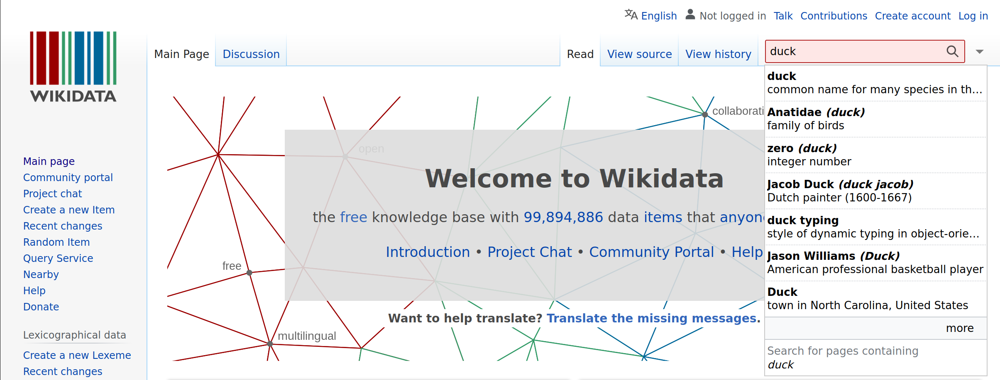
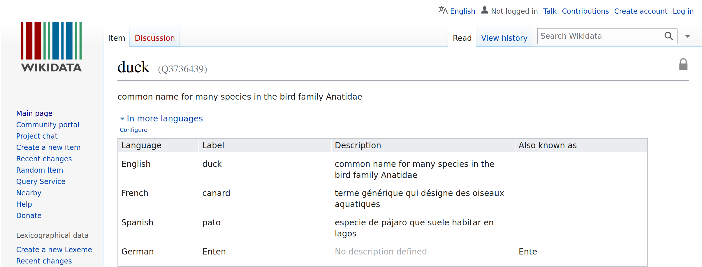
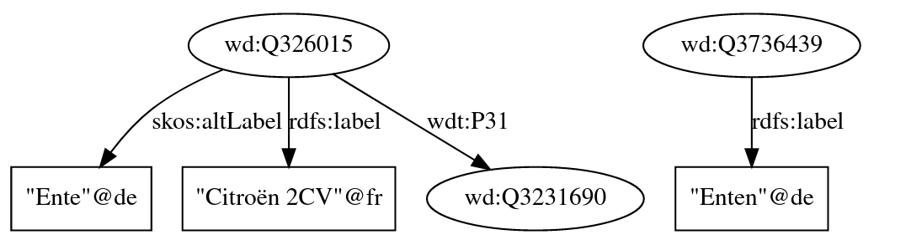

# Project: Query Answering over Linked Data
## Introduction

This report will be documenting my work over using linked data database to answer real world questions. The technology used for that will be SPARQL, a querying language close to SQL but specialized in the use of linked data databases. The work has been done in 2 Jupyter notebooks, one for each question of the project.

## Question 1

The first problem I tried to tackle in this project was to try to answer a rather simple but yet specialized question. It was for me a way to initiate myself to the use of the SPARQL language and the browsing of linked databases.

The question I choosed to answer was `"Which car is called a “duck” in German?"`.

To solve this problem I had to answer multiple interrogations I had, see below.

### What source of data should I use ?

The first thing to determine was which source of data should I use to answer the question ? Multiple valid choices existed, so I began experimenting.

#### DBPedia

The first source of data I knew of was the website of DBPedia https://www.dbpedia.org/. Because it was referenced during our semantic web course in Polytech, in first I began searching on their website how to manually browse their database, to see if I was able to find the entities that where linked to my question: a `duck` and a `car`. This was harder than I thought because DBPedia doesn't provide a way to manually research entities through a search bar in the manner of the Google search engine.
The only way I found to browse existing data was through SPARQL queries. That appeared too hard for me, so I quickly decided to search for another data source for my problem.

#### WikiData

The second data source I knew was WikiData accessible at the url https://www.wikidata.org/. This data source have the avantage to offer a search bar wich allow everyone to just type in a word or some text and find some close results to what you are looking for.

For instance for the entity corresponding to a duck, we can type in the word `duck` and instantly find a link to the corresponding ressource (see figure below).



Then by clicking on it we have all informations about the entity displayed. Here we can see that an unique identifier is assiocated to the duck entity: `Q3736439`. Thus we will be able to use it for our problem solving (see below).



### How to translate my problem in a SPARQL query ?

Now that the datasource is chosen, I need to translate my question in a SPARQL query. To do that I will need to identify the features of the SPARQL language that will be useful for my problem.

My problem is to determine `"Which car is called a “duck” in German?"`.

#### String comparaison

To find which car is called `"duck"` there will be a operation of string comparaison involved at some point in my query so I searched what I could use to accomplish this comparaison. I searched on a search engine `"comparing strings in sparql"` and found the following function:

```sql
FILTER(ex:ldistance(?string1, ?string2) < 2)
```

This function returns `true` if the two string provided have a `Levenshtein distance` inferior to 2 in the previous example. But when I tried using it it wasn't recognized as a valid function so I searched for another function.

```sql
FILTER(STRSTARTS(?string1, ?string2))
```

The second function I found to compare string was `STRSTARTS`. It returns `true` when `string1` starts with `string2`. It will be useful to compare the name of a duck in german with the name of the cars.

#### Entities involved

The two entities I wanted to use as a base for my query were the `duck` entity and the `car` entity. As shown previously I already found the `duck` entity easily. Then I had to find the `car` entity.

After doing a quick search in the search bar I found the entity `Q1420` (see figure below).


But when I wanted to list all car names I got only a few hundred names which is far from from the total number of names (see figure below) of car model, so I decided to use another entity.


I tried typing my car model name on WikiData search bar `Peugeot 107`. I found that the entity assiocated was instead `automobile model (Q3231690)`. So I decided to use this entity instead for my query (see below).


Finally I tried to use the `rdfs:label` of the entities to compare them (the duck and the car model). But after multiple unsuccessful results, I found out that the car model `rdfs:label` did not include the car's nickname. So I discovered I could use instead the `skos:altLabel` property of the entities that contained many more nicknames for the entity.

#### Filtering

As a final requirement I needed to filter my result, I wanted to compare only the german `skos:altLabel` of the car with the german `rdfs:label`. So I searched and found the `LANG` function (see below).

```sql
-- Car
?model wdt:P31 wd:Q3231690;
    skos:altLabel ?modelAlias;
    FILTER(LANG(?modelAlias) = "de").

-- Duck
wd:Q3736439 rdfs:label ?duckLabel;
    FILTER(LANG(?duckLabel) = "de").
```
#### The query and result

With all the previous work done earlier I finally was able to write a working query that gave me the following result (see below).

```sql
-- Which car is called a “duck” in German ?

CONSTRUCT {
    --      instance of    automobile model
    ?model wdt:P31         wd:Q3231690;
        skos:altLabel ?modelAlias;
        rdfs:label ?modelLabel.
            
    -- Duck
    wd:Q3736439 rdfs:label ?duckLabel.
}
WHERE 
{
    --     instance of     automobile model
    ?model wdt:P31         wd:Q3231690;
        skos:altLabel ?modelAlias;
        rdfs:label ?modelLabel;
    FILTER(LANG(?modelAlias) = "de").
    FILTER(LANG(?modelLabel) = "fr").
    FILTER(STRSTARTS(?duckLabel, ?modelAlias)).
            
    -- Duck
    wd:Q3736439 rdfs:label ?duckLabel;
        FILTER(LANG(?duckLabel) = "de").
    
}
```


Here we can see that the car found is the `Citroën 2CV`. They both have a label and/or an alias wich begin with the string `Ente`.

## Question 2

### Problem I want to solve
With what other famous people did Barck Obama studied throughout his life ?

### Data source

For this question I will use the same data source as the previous question: WikiData.

### Entities I need

For this question I will need the following entities:

- Barack Obama `Q76`
- Human `Q5`

### Relations I need

For this question I will need the following relations:

- educated at `P69`

### My experiments

#### Listing the schools of Barack Obama

To list the schools of Barack Obama I used the following query:

```sql
%%rdf sparql --endpoint https://query.wikidata.org/sparql

# With what other famous people did Barck Obama studied throughout his life ?

SELECT ?schoolLabel
WHERE 
{
    # Barrack Obama   # Educated At
    wd:Q76            wdt:P69          ?school.
    ?school rdfs:label ?schoolLabel;
        FILTER(LANG(?schoolLabel) = "en"). 
}
```

## Listing 100 people who have studied at the same school as Barack Obama

To list 100 people who have studied at the same school as Barack Obama I used the following query:

```sql
%%rdf sparql --endpoint https://query.wikidata.org/sparql

-- With what other famous people did Barck Obama studied throughout his life ?

SELECT ?personName
WHERE 
{
    -- Barrack Obama   -- Educated At
    wd:Q76            wdt:P69          ?school.
    ?school rdfs:label ?schoolLabel;
    FILTER(LANG(?schoolLabel) = "en").
    
            -- instance of  -- Human  
    ?person wdt:P31        wd:Q5;
        -- Educated At
        wdt:P69         ?school2;
        rdfs:label ?personName.
    FILTER(LANG(?personName) = "en").
    FILTER(?school = ?school2).
}
LIMIT 100
```

 ### Problem encountered


#### Filtering with date

 When I tried to filter the result to only keep the people who studied has Barack Obama did, It became harder for me. The relation `educated at` had a qualifier `start time` but I didn't know how to use it. So I had to look up WikiData documentation to find out how to use it.

 After reading the documentation I found an example describing a similar problem to mine. So I tried to use it in my query and after mutiple tries I finally got a working query.

```sql
    --! Educated At
    ?person p:P69 [
            --! Educated At
            ps:P69 ?school;
            --! Start Time
            pq:P580 ?date
        ];
```

Then I had to filter the result to only keep the people who studied at the same school as Barack Obama and who were in the same school as Barack Obama when he was also studying there.

```sql
FILTER(?school=?schoolObama && ((?startDate <= ?endDateObama &&  ?endDate >= ?startDateObama) || (?startDateObama <= ?endDate &&  ?endDateObama >= ?startDate)))
```
 #### Removing Barack Obama from the results

I also wanted to remove Barack Obama from the result, because Barack Obama indeed studied in the same school and at the same period that Barack Obama. So I had to find a way to remove him from the result. I tried to use the `FILTER`.

```sql
FILTER(?person != wd:Q76).
```

 ### The query and result


```sql
SELECT DISTINCT ?personName ?date ?schoolLabel
WHERE 
{
    # Barrack Obama   # Educated At
    wd:Q76            p:P69        [
            ps:P69 ?school;
            pq:P580 ?date
    ].
   
            # instance of  # Human  
    ?person wdt:P31        wd:Q5.
            
        # Educated At
    ?person p:P69 [
            ps:P69 ?school;
            pq:P580 ?date
        ];
        rdfs:label ?personName.
    
   
    ?school rdfs:label ?schoolLabel;
        FILTER(LANG(?schoolLabel) = "en"). 
    FILTER(LANG(?personName) = "en").
  FILTER(?person != wd:Q76).
}
```

<table><thead><tr><th>nom</th><th>startDate</th><th>endDate</th><th>schoolName</th></tr></thead><tbody><tr><td>Elva Diaz</td><td>1989-09-01T00:00:00Z</td><td>1993-06-01T00:00:00Z</td><td>Harvard University</td></tr><tr><td>Alexander Wei</td><td>1989-01-01T00:00:00Z</td><td>1995-01-01T00:00:00Z</td><td>Harvard University</td></tr><tr><td>Rachel L Rosen</td><td>1990-01-01T00:00:00Z</td><td>1994-01-01T00:00:00Z</td><td>Harvard University</td></tr><tr><td>Conal Murray</td><td>1987-09-13T00:00:00Z</td><td>1992-06-06T00:00:00Z</td><td>Harvard University</td></tr><tr><td>Michael Luke</td><td>1987-09-01T00:00:00Z</td><td>1989-06-30T00:00:00Z</td><td>Harvard University</td></tr><tr><td>Michael Luke</td><td>1987-09-01T00:00:00Z</td><td>1991-06-30T00:00:00Z</td><td>Harvard University</td></tr><tr><td>Yong Hwan Kim</td><td>1987-09-01T00:00:00Z</td><td>1993-06-08T00:00:00Z</td><td>Harvard University</td></tr><tr><td>Jin Chen</td><td>1986-06-21T00:00:00Z</td><td>1991-12-31T00:00:00Z</td><td>Harvard University</td></tr><tr><td>Marios Mavronicolas</td><td>1984-01-01T00:00:00Z</td><td>1992-01-01T00:00:00Z</td><td>Harvard University</td></tr><tr><td>Ken Uchino</td><td>1986-09-01T00:00:00Z</td><td>1990-06-01T00:00:00Z</td><td>Harvard University</td></tr><tr><td>David J Yaron</td><td>1983-09-01T00:00:00Z</td><td>1990-06-01T00:00:00Z</td><td>Harvard University</td></tr><tr><td>Erick Moran Carreira</td><td>1984-09-01T00:00:00Z</td><td>1990-05-31T00:00:00Z</td><td>Harvard University</td></tr><tr><td>Lynn E Dobrunz</td><td>1984-01-01T00:00:00Z</td><td>1988-01-01T00:00:00Z</td><td>Harvard University</td></tr><tr><td>Scott Presnell</td><td>1983-09-01T00:00:00Z</td><td>1988-06-01T00:00:00Z</td><td>Harvard University</td></tr><tr><td>Saumya Das</td><td>1987-09-01T00:00:00Z</td><td>1991-06-01T00:00:00Z</td><td>Harvard University</td></tr><tr><td>T Kwaku Dayie</td><td>1990-09-01T00:00:00Z</td><td>1996-05-01T00:00:00Z</td><td>Harvard University</td></tr><tr><td>Mark L Dell'Acqua</td><td>1989-09-01T00:00:00Z</td><td>1995-07-30T00:00:00Z</td><td>Harvard University</td></tr><tr><td>Mariana Chilton</td><td>1986-09-11T00:00:00Z</td><td>1991-06-01T00:00:00Z</td><td>Harvard University</td></tr><tr><td>Qizhou Zhang</td><td>1991-01-01T00:00:00Z</td><td>1996-01-01T00:00:00Z</td><td>Harvard University</td></tr><tr><td>Giuseppe Labianca</td><td>1985-09-01T00:00:00Z</td><td>1989-06-01T00:00:00Z</td><td>Harvard University</td></tr><tr><td>Sanford Sillman</td><td>1983-09-01T00:00:00Z</td><td>1988-01-20T00:00:00Z</td><td>Harvard University</td></tr><tr><td>Geoffrey S. Plumlee</td><td>1980-08-31T00:00:00Z</td><td>1989-06-06T00:00:00Z</td><td>Harvard University</td></tr><tr><td>Shelia M Kennison</td><td>1985-09-10T00:00:00Z</td><td>1989-06-10T00:00:00Z</td><td>Harvard University</td></tr><tr><td>Michael Pravica</td><td>1988-06-01T00:00:00Z</td><td>1998-06-01T00:00:00Z</td><td>Harvard University</td></tr><tr><td>Yuh-Dauh Lyuu</td><td>1984-08-01T00:00:00Z</td><td>1989-11-01T00:00:00Z</td><td>Harvard University</td></tr><tr><td>Yuh-Dauh Lyuu</td><td>1984-08-01T00:00:00Z</td><td>1990-11-01T00:00:00Z</td><td>Harvard University</td></tr><tr><td>Christian Smith</td><td>1984-01-01T00:00:00Z</td><td>1990-01-01T00:00:00Z</td><td>Harvard University</td></tr><tr><td>Eric Weinstein</td><td>1985-01-01T00:00:00Z</td><td>1992-01-01T00:00:00Z</td><td>Harvard University</td></tr><tr><td>J. William Carey</td><td>1985-09-01T00:00:00Z</td><td>1991-06-01T00:00:00Z</td><td>Harvard University</td></tr><tr><td>Stephen C. Bunnell</td><td>1990-01-01T00:00:00Z</td><td>1998-01-01T00:00:00Z</td><td>Harvard University</td></tr><tr><td>Charles Marcus</td><td>1990-01-01T00:00:00Z</td><td>1992-01-01T00:00:00Z</td><td>Harvard University</td></tr><tr><td>Charles Marcus</td><td>1984-09-01T00:00:00Z</td><td>1990-06-01T00:00:00Z</td><td>Harvard University</td></tr><tr><td>Robert C. Lieberman</td><td>1988-01-01T00:00:00Z</td><td>1994-01-01T00:00:00Z</td><td>Harvard University</td></tr><tr><td>Robert C. Lieberman</td><td>1988-01-01T00:00:00Z</td><td>1994-01-01T00:00:00Z</td><td>Harvard University</td></tr><tr><td>Andrew T Morehead</td><td>1985-09-21T00:00:00Z</td><td>1989-06-10T00:00:00Z</td><td>Harvard University</td></tr><tr><td>Philip Seo</td><td>1989-09-01T00:00:00Z</td><td>1993-06-30T00:00:00Z</td><td>Harvard University</td></tr><tr><td>Jean T Greenberg</td><td>1983-01-01T00:00:00Z</td><td>1989-01-01T00:00:00Z</td><td>Harvard University</td></tr><tr><td>Randall S. Johnson</td><td>1986-09-01T00:00:00Z</td><td>1992-12-31T00:00:00Z</td><td>Harvard University</td></tr><tr><td>Jay W. Hooper</td><td>1989-01-01T00:00:00Z</td><td>1995-01-01T00:00:00Z</td><td>Harvard University</td></tr><tr><td>Bennett G. Novitch</td><td>1991-01-01T00:00:00Z</td><td>1998-01-01T00:00:00Z</td><td>Harvard University</td></tr><tr><td>Hongtao Yu</td><td>1990-09-01T00:00:00Z</td><td>1995-05-01T00:00:00Z</td><td>Harvard University</td></tr><tr><td>Kathleen Gallo</td><td>1985-01-01T00:00:00Z</td><td>1992-01-01T00:00:00Z</td><td>Harvard University</td></tr><tr><td>Kyriakos Mitsotakis</td><td>1986-01-01T00:00:00Z</td><td>1990-01-01T00:00:00Z</td><td>Harvard University</td></tr><tr><td>Angela Duckworth</td><td>1988-01-01T00:00:00Z</td><td>1992-01-01T00:00:00Z</td><td>Harvard University</td></tr><tr><td>Darin Toohey</td><td>1982-09-01T00:00:00Z</td><td>1988-07-01T00:00:00Z</td><td>Harvard University</td></tr><tr><td>Chu, Ping-Tzu</td><td>1990-01-01T00:00:00Z</td><td>1998-01-01T00:00:00Z</td><td>Harvard University</td></tr><tr><td>Michael F. Koehler</td><td>1988-01-01T00:00:00Z</td><td>1992-01-01T00:00:00Z</td><td>Harvard University</td></tr><tr><td>Chaitanya Jain</td><td>1983-01-01T00:00:00Z</td><td>1991-01-01T00:00:00Z</td><td>Harvard University</td></tr><tr><td>Ann Stokes</td><td>1988-01-01T00:00:00Z</td><td>1993-01-01T00:00:00Z</td><td>Harvard University</td></tr><tr><td>Sheng Luan</td><td>1986-08-23T00:00:00Z</td><td>1991-08-31T00:00:00Z</td><td>Harvard University</td></tr><tr><td>Jeffrey S Mckinnon</td><td>1987-09-01T00:00:00Z</td><td>1994-01-01T00:00:00Z</td><td>Harvard University</td></tr><tr><td>Kim Gutschow</td><td>1990-01-01T00:00:00Z</td><td>1998-01-01T00:00:00Z</td><td>Harvard University</td></tr><tr><td>Kim Gutschow</td><td>1984-01-01T00:00:00Z</td><td>1998-01-01T00:00:00Z</td><td>Harvard University</td></tr><tr><td>Hajime Tokuno</td><td>1984-08-01T00:00:00Z</td><td>1988-05-30T00:00:00Z</td><td>Harvard University</td></tr><tr><td>Christopher Cannon</td><td>1988-09-01T00:00:00Z</td><td>1993-06-15T00:00:00Z</td><td>Harvard University</td></tr><tr><td>Bomie Han</td><td>1989-09-01T00:00:00Z</td><td>1995-06-01T00:00:00Z</td><td>Harvard University</td></tr><tr><td>Colin Philip Jessop</td><td>1987-06-01T00:00:00Z</td><td>1993-12-13T00:00:00Z</td><td>Harvard University</td></tr><tr><td>David Nathan Brown</td><td>1983-09-01T00:00:00Z</td><td>1989-06-01T00:00:00Z</td><td>Harvard University</td></tr><tr><td>Edward Frenkel</td><td>1990-01-01T00:00:00Z</td><td>1991-01-01T00:00:00Z</td><td>Harvard University</td></tr><tr><td>Huajian Gao</td><td>1983-09-01T00:00:00Z</td><td>1988-06-09T00:00:00Z</td><td>Harvard University</td></tr><tr><td>Santiago Madriñán</td><td>1989-09-01T00:00:00Z</td><td>1996-12-31T00:00:00Z</td><td>Harvard University</td></tr><tr><td>Ivan Oransky</td><td>1990-09-01T00:00:00Z</td><td>1994-05-01T00:00:00Z</td><td>Harvard University</td></tr><tr><td>Hyeonsik Cheong</td><td>1986-09-01T00:00:00Z</td><td>1993-06-08T00:00:00Z</td><td>Harvard University</td></tr><tr><td>Phillip D. Zamore</td><td>1987-01-01T00:00:00Z</td><td>1992-06-01T00:00:00Z</td><td>Harvard University</td></tr><tr><td>David Morse</td><td>1985-01-01T00:00:00Z</td><td>1989-01-01T00:00:00Z</td><td>Harvard University</td></tr><tr><td>Paul D King</td><td>1984-09-01T00:00:00Z</td><td>1988-06-08T00:00:00Z</td><td>Harvard University</td></tr><tr><td>Albert Young</td><td>1982-09-01T00:00:00Z</td><td>1990-06-01T00:00:00Z</td><td>Harvard University</td></tr><tr><td>Yuh Min Chook</td><td>1988-09-01T00:00:00Z</td><td>1993-11-30T00:00:00Z</td><td>Harvard University</td></tr><tr><td>Brian E Schultz</td><td>1989-01-01T00:00:00Z</td><td>1994-01-01T00:00:00Z</td><td>Harvard University</td></tr><tr><td>Chen-Ming Fan</td><td>1986-09-01T00:00:00Z</td><td>1991-08-01T00:00:00Z</td><td>Harvard University</td></tr><tr><td>Kenneth H Yu</td><td>1991-01-01T00:00:00Z</td><td>1995-01-01T00:00:00Z</td><td>Harvard University</td></tr><tr><td>Robert Tykot</td><td>1984-01-01T00:00:00Z</td><td>1995-01-01T00:00:00Z</td><td>Harvard University</td></tr><tr><td>Grazyna Jasienska</td><td>1989-01-01T00:00:00Z</td><td>1996-01-01T00:00:00Z</td><td>Harvard University</td></tr><tr><td>Robert T Brennan</td><td>1983-09-01T00:00:00Z</td><td>1989-06-01T00:00:00Z</td><td>Harvard University</td></tr><tr><td>David Ackerly</td><td>1987-05-01T00:00:00Z</td><td>1993-05-01T00:00:00Z</td><td>Harvard University</td></tr><tr><td>Leticia Avilés</td><td>1988-09-01T00:00:00Z</td><td>1992-05-15T00:00:00Z</td><td>Harvard University</td></tr><tr><td>Roland K Strong</td><td>1984-01-01T00:00:00Z</td><td>1990-01-01T00:00:00Z</td><td>Harvard University</td></tr><tr><td>Douglas K Bishop</td><td>1981-09-01T00:00:00Z</td><td>1988-05-01T00:00:00Z</td><td>Harvard University</td></tr><tr><td>Jih-I Yeh</td><td>1988-09-01T00:00:00Z</td><td>1995-06-01T00:00:00Z</td><td>Harvard University</td></tr><tr><td>Paul Nihoul</td><td>1988-01-01T00:00:00Z</td><td>1989-01-01T00:00:00Z</td><td>Harvard University</td></tr><tr><td>David Wittman</td><td>1986-09-01T00:00:00Z</td><td>1990-06-01T00:00:00Z</td><td>Harvard University</td></tr><tr><td>María Paz Espinosa</td><td>1984-01-01T00:00:00Z</td><td>1988-01-01T00:00:00Z</td><td>Harvard University</td></tr><tr><td>Thomas R. Belin</td><td>1986-09-23T00:00:00Z</td><td>1991-06-12T00:00:00Z</td><td>Harvard University</td></tr><tr><td>David S Moore</td><td>1985-05-16T00:00:00Z</td><td>1988-05-15T00:00:00Z</td><td>Harvard University</td></tr><tr><td>Peter Groeneveld</td><td>1987-09-15T00:00:00Z</td><td>1991-06-06T00:00:00Z</td><td>Harvard University</td></tr><tr><td>Regina Llamas</td><td>1989-01-01T00:00:00Z</td><td>1992-01-01T00:00:00Z</td><td>Harvard University</td></tr><tr><td>James Livesey</td><td>1988-09-01T00:00:00Z</td><td>1994-11-30T00:00:00Z</td><td>Harvard University</td></tr><tr><td>Sohee Park</td><td>1985-09-01T00:00:00Z</td><td>1991-06-07T00:00:00Z</td><td>Harvard University</td></tr><tr><td>Iain M. Cockburn</td><td>1984-01-01T00:00:00Z</td><td>1990-01-01T00:00:00Z</td><td>Harvard University</td></tr><tr><td>Joshua T. Cohen</td><td>1989-09-01T00:00:00Z</td><td>1994-06-01T00:00:00Z</td><td>Harvard University</td></tr><tr><td>James K. Chen</td><td>1987-09-01T00:00:00Z</td><td>1991-06-01T00:00:00Z</td><td>Harvard University</td></tr><tr><td>Edus H Warren</td><td>1983-09-01T00:00:00Z</td><td>1988-11-01T00:00:00Z</td><td>Harvard University</td></tr><tr><td>Roland Dunbrack</td><td>1987-09-10T00:00:00Z</td><td>1993-06-10T00:00:00Z</td><td>Harvard University</td></tr><tr><td>Maureen A Su</td><td>1991-01-01T00:00:00Z</td><td>1995-01-01T00:00:00Z</td><td>Harvard University</td></tr><tr><td>Thomas T Perkins</td><td>1985-09-01T00:00:00Z</td><td>1989-06-01T00:00:00Z</td><td>Harvard University</td></tr><tr><td>Abigail S. Gertner</td><td>1986-01-01T00:00:00Z</td><td>1990-01-01T00:00:00Z</td><td>Harvard University</td></tr><tr><td>Kristin Wobbe</td><td>1984-01-01T00:00:00Z</td><td>1991-01-01T00:00:00Z</td><td>Harvard University</td></tr><tr><td>Pin Ouyang</td><td>1985-09-01T00:00:00Z</td><td>1992-08-01T00:00:00Z</td><td>Harvard University</td></tr><tr><td>Yang Wang</td><td>1983-10-01T00:00:00Z</td><td>1990-06-01T00:00:00Z</td><td>Harvard University</td></tr><tr><td>Isabel Hanekamp</td><td>1987-09-01T00:00:00Z</td><td>1993-05-15T00:00:00Z</td><td>Harvard University</td></tr><tr><td>Jing-Shiang Hwang</td><td>1988-01-01T00:00:00Z</td><td>1992-01-01T00:00:00Z</td><td>Harvard University</td></tr><tr><td>Leonardo Trasande</td><td>1990-09-01T00:00:00Z</td><td>1994-06-01T00:00:00Z</td><td>Harvard University</td></tr><tr><td>Colin A Chapman</td><td>1990-01-01T00:00:00Z</td><td>1993-01-01T00:00:00Z</td><td>Harvard University</td></tr><tr><td>Richard D. Norris</td><td>1986-08-15T00:00:00Z</td><td>1990-06-20T00:00:00Z</td><td>Harvard University</td></tr><tr><td>Alison J. Frontier</td><td>1988-01-01T00:00:00Z</td><td>1992-06-01T00:00:00Z</td><td>Harvard University</td></tr><tr><td>Amir D Karger</td><td>1990-09-01T00:00:00Z</td><td>1994-06-10T00:00:00Z</td><td>Harvard University</td></tr><tr><td>Alisa Schoenbach</td><td>1989-09-01T00:00:00Z</td><td>1993-06-01T00:00:00Z</td><td>Harvard University</td></tr><tr><td>Benjamin S. Twining</td><td>1989-09-01T00:00:00Z</td><td>1997-05-01T00:00:00Z</td><td>Harvard University</td></tr><tr><td>John R. Iversen</td><td>1986-09-01T00:00:00Z</td><td>1990-06-01T00:00:00Z</td><td>Harvard University</td></tr><tr><td>Ing-Shouh Hwang</td><td>1988-06-01T00:00:00Z</td><td>1993-06-01T00:00:00Z</td><td>Harvard University</td></tr><tr><td>Yves Balkanski</td><td>1985-09-01T00:00:00Z</td><td>1991-06-01T00:00:00Z</td><td>Harvard University</td></tr><tr><td>James Topitzes</td><td>1984-01-01T00:00:00Z</td><td>1998-01-01T00:00:00Z</td><td>Harvard University</td></tr><tr><td>Michal Jasienski</td><td>1985-01-01T00:00:00Z</td><td>1992-01-01T00:00:00Z</td><td>Harvard University</td></tr><tr><td>Karen M Ottemann</td><td>1988-09-20T00:00:00Z</td><td>1994-06-10T00:00:00Z</td><td>Harvard University</td></tr><tr><td>W. Dean Hively</td><td>1987-01-01T00:00:00Z</td><td>1990-01-01T00:00:00Z</td><td>Harvard University</td></tr><tr><td>Michael Spall</td><td>1983-09-01T00:00:00Z</td><td>1988-05-01T00:00:00Z</td><td>Harvard University</td></tr><tr><td>Seiichi P T Matsuda</td><td>1986-09-01T00:00:00Z</td><td>1994-01-01T00:00:00Z</td><td>Harvard University</td></tr><tr><td>Soojin Ryu</td><td>1990-01-01T00:00:00Z</td><td>1994-01-01T00:00:00Z</td><td>Harvard University</td></tr><tr><td>Jeanne L Shea</td><td>1990-01-01T00:00:00Z</td><td>1998-01-01T00:00:00Z</td><td>Harvard University</td></tr><tr><td>Gilbert Gimm</td><td>1987-09-01T00:00:00Z</td><td>1992-05-28T00:00:00Z</td><td>Harvard University</td></tr><tr><td>Barbara L Dunn</td><td>1981-09-15T00:00:00Z</td><td>1988-12-10T00:00:00Z</td><td>Harvard University</td></tr><tr><td>Wang Ming-ke</td><td>1987-01-01T00:00:00Z</td><td>1992-01-01T00:00:00Z</td><td>Harvard University</td></tr><tr><td>Kuei-Hsien Chen</td><td>1985-09-01T00:00:00Z</td><td>1989-06-30T00:00:00Z</td><td>Harvard University</td></tr><tr><td>Deborah A Hogan</td><td>1989-01-01T00:00:00Z</td><td>1993-01-01T00:00:00Z</td><td>Harvard University</td></tr><tr><td>Helen M Hanson</td><td>1988-09-01T00:00:00Z</td><td>1990-06-01T00:00:00Z</td><td>Harvard University</td></tr><tr><td>Helen M Hanson</td><td>1990-09-01T00:00:00Z</td><td>1995-06-01T00:00:00Z</td><td>Harvard University</td></tr><tr><td>Jeffrey A. Yoder</td><td>1990-01-01T00:00:00Z</td><td>1997-01-01T00:00:00Z</td><td>Harvard University</td></tr><tr><td>Jim Bryan</td><td>1989-06-01T00:00:00Z</td><td>1994-06-01T00:00:00Z</td><td>Harvard University</td></tr><tr><td>Lincoln Greenhill</td><td>1984-09-01T00:00:00Z</td><td>1990-06-01T00:00:00Z</td><td>Harvard University</td></tr><tr><td>Orlando D Schärer</td><td>1991-01-01T00:00:00Z</td><td>1996-01-01T00:00:00Z</td><td>Harvard University</td></tr><tr><td>Anne E West</td><td>1989-01-01T00:00:00Z</td><td>1998-01-01T00:00:00Z</td><td>Harvard University</td></tr><tr><td>Cheleste M Thorpe</td><td>1986-09-01T00:00:00Z</td><td>1989-06-01T00:00:00Z</td><td>Harvard University</td></tr><tr><td>Germán Fuertes Otero</td><td>1990-01-01T00:00:00Z</td><td>1995-01-01T00:00:00Z</td><td>Harvard University</td></tr><tr><td>Li-Chyong Chen</td><td>1983-09-01T00:00:00Z</td><td>1989-08-31T00:00:00Z</td><td>Harvard University</td></tr><tr><td>Robert F. Standaert</td><td>1988-09-01T00:00:00Z</td><td>1992-06-02T00:00:00Z</td><td>Harvard University</td></tr><tr><td>Christopher H. Schmid</td><td>1985-09-01T00:00:00Z</td><td>1991-09-01T00:00:00Z</td><td>Harvard University</td></tr><tr><td>Edward Kearns</td><td>1982-05-01T00:00:00Z</td><td>1990-05-01T00:00:00Z</td><td>Harvard University</td></tr><tr><td>Joshua M. Brickman</td><td>1988-09-21T00:00:00Z</td><td>1996-06-01T00:00:00Z</td><td>Harvard University</td></tr><tr><td>Frank S. Lee</td><td>1985-01-01T00:00:00Z</td><td>1991-01-01T00:00:00Z</td><td>Harvard University</td></tr><tr><td>Savdeep Sethi</td><td>1991-01-01T00:00:00Z</td><td>1992-01-01T00:00:00Z</td><td>Harvard University</td></tr><tr><td>Savdeep Sethi</td><td>1991-01-01T00:00:00Z</td><td>1996-01-01T00:00:00Z</td><td>Harvard University</td></tr><tr><td>Yana van der Meulen Rodgers</td><td>1987-09-01T00:00:00Z</td><td>1993-05-15T00:00:00Z</td><td>Harvard University</td></tr><tr><td>Yana van der Meulen Rodgers</td><td>1987-09-01T00:00:00Z</td><td>1989-05-15T00:00:00Z</td><td>Harvard University</td></tr><tr><td>Shadi Bartsch</td><td>1987-09-01T00:00:00Z</td><td>1988-06-01T00:00:00Z</td><td>Harvard University</td></tr><tr><td>Brian McGill</td><td>1984-09-01T00:00:00Z</td><td>1988-06-01T00:00:00Z</td><td>Harvard University</td></tr><tr><td>Michael L Dustin</td><td>1984-09-01T00:00:00Z</td><td>1990-06-01T00:00:00Z</td><td>Harvard University</td></tr><tr><td>Lynn B. Dustin</td><td>1984-09-01T00:00:00Z</td><td>1990-06-01T00:00:00Z</td><td>Harvard University</td></tr><tr><td>Michael Merrifield</td><td>1986-08-01T00:00:00Z</td><td>1990-08-01T00:00:00Z</td><td>Harvard University</td></tr><tr><td>Laura M Kasman</td><td>1987-08-15T00:00:00Z</td><td>1992-02-14T00:00:00Z</td><td>Harvard University</td></tr><tr><td>Olav Sorenson</td><td>1988-01-01T00:00:00Z</td><td>1991-01-01T00:00:00Z</td><td>Harvard University</td></tr><tr><td>Mun Sing Ho</td><td>1983-01-01T00:00:00Z</td><td>1989-01-01T00:00:00Z</td><td>Harvard University</td></tr><tr><td>Janet Conrad</td><td>1986-01-01T00:00:00Z</td><td>1993-01-01T00:00:00Z</td><td>Harvard University</td></tr><tr><td>Peter Goekjian</td><td>1984-09-01T00:00:00Z</td><td>1990-12-14T00:00:00Z</td><td>Harvard University</td></tr><tr><td>Sunil Shaw</td><td>1988-08-01T00:00:00Z</td><td>2005-06-01T00:00:00Z</td><td>Harvard University</td></tr><tr><td>David DeBoer</td><td>1985-01-01T00:00:00Z</td><td>1989-01-01T00:00:00Z</td><td>Harvard University</td></tr><tr><td>J T Hunt</td><td>1979-01-01T00:00:00Z</td><td>1981-01-01T00:00:00Z</td><td>Columbia University</td></tr><tr><td>Chiou-Shann Fuh</td><td>1987-09-01T00:00:00Z</td><td>1992-06-04T00:00:00Z</td><td>Harvard University</td></tr><tr><td>Christos Delidakis</td><td>1981-05-01T00:00:00Z</td><td>1988-05-01T00:00:00Z</td><td>Harvard University</td></tr><tr><td>Shing Chuan Hooi</td><td>1987-01-01T00:00:00Z</td><td>1992-01-01T00:00:00Z</td><td>Harvard University</td></tr><tr><td>Susan Wojcicki</td><td>1986-01-01T00:00:00Z</td><td>1990-01-01T00:00:00Z</td><td>Harvard University</td></tr><tr><td>Arianna Carughi</td><td>1981-01-01T00:00:00Z</td><td>1982-01-01T00:00:00Z</td><td>Columbia University</td></tr><tr><td>Philip Barnett</td><td>1979-08-01T00:00:00Z</td><td>1981-06-30T00:00:00Z</td><td>Columbia University</td></tr><tr><td>Carlos A Klink</td><td>1987-09-22T00:00:00Z</td><td>1992-04-15T00:00:00Z</td><td>Harvard University</td></tr><tr><td>Nigel Rothfels</td><td>1987-01-01T00:00:00Z</td><td>1994-01-01T00:00:00Z</td><td>Harvard University</td></tr><tr><td>Laura F Landweber</td><td>1989-09-01T00:00:00Z</td><td>1993-06-01T00:00:00Z</td><td>Harvard University</td></tr><tr><td>Daniel M Kammen</td><td>1985-01-01T00:00:00Z</td><td>1988-06-10T00:00:00Z</td><td>Harvard University</td></tr><tr><td>Robert J O'Hara</td><td>1984-01-01T00:00:00Z</td><td>1989-01-01T00:00:00Z</td><td>Harvard University</td></tr><tr><td>David F. Phillips</td><td>1988-09-01T00:00:00Z</td><td>1996-01-15T00:00:00Z</td><td>Harvard University</td></tr><tr><td>Annelise Riles</td><td>1990-01-01T00:00:00Z</td><td>1993-01-01T00:00:00Z</td><td>Harvard University</td></tr><tr><td>Kentaro Toyama</td><td>1987-01-01T00:00:00Z</td><td>1991-01-01T00:00:00Z</td><td>Harvard University</td></tr><tr><td>Meredith R. Golomb</td><td>1986-01-01T00:00:00Z</td><td>1990-01-01T00:00:00Z</td><td>Harvard University</td></tr><tr><td>Grace Chen</td><td>1989-01-01T00:00:00Z</td><td>1993-01-01T00:00:00Z</td><td>Harvard University</td></tr><tr><td>Luis Manuel Navas</td><td>1984-01-01T00:00:00Z</td><td>1988-01-01T00:00:00Z</td><td>Harvard University</td></tr><tr><td>Ria Carlo</td><td>1989-01-01T00:00:00Z</td><td>1992-01-01T00:00:00Z</td><td>Harvard University</td></tr><tr><td>Bert Vaux</td><td>1990-09-01T00:00:00Z</td><td>1992-06-01T00:00:00Z</td><td>Harvard University</td></tr><tr><td>Bert Vaux</td><td>1990-09-01T00:00:00Z</td><td>1994-05-24T00:00:00Z</td><td>Harvard University</td></tr><tr><td>Ketanji Brown Jackson</td><td>1988-01-01T00:00:00Z</td><td>1992-01-01T00:00:00Z</td><td>Harvard University</td></tr><tr><td>Lisa Shalett</td><td>1984-01-01T00:00:00Z</td><td>1988-01-01T00:00:00Z</td><td>Harvard University</td></tr><tr><td>Sung-Yun Pai</td><td>1985-01-01T00:00:00Z</td><td>1989-01-01T00:00:00Z</td><td>Harvard University</td></tr><tr><td>Eva Huala</td><td>1983-06-01T00:00:00Z</td><td>1990-06-01T00:00:00Z</td><td>Harvard University</td></tr><tr><td>Chi-Kuang Sun</td><td>1990-09-01T00:00:00Z</td><td>1994-11-01T00:00:00Z</td><td>Harvard University</td></tr><tr><td>Allen H Goldstein</td><td>1989-09-01T00:00:00Z</td><td>1994-06-01T00:00:00Z</td><td>Harvard University</td></tr><tr><td>Jeffrey Glueck</td><td>1987-01-01T00:00:00Z</td><td>1991-01-01T00:00:00Z</td><td>Harvard University</td></tr><tr><td>Nirav R Shah</td><td>1990-01-01T00:00:00Z</td><td>1994-01-01T00:00:00Z</td><td>Harvard University</td></tr><tr><td>Ajay Nagpal</td><td>1990-01-01T00:00:00Z</td><td>1992-01-01T00:00:00Z</td><td>Harvard University</td></tr><tr><td>Stephen W Wright</td><td>1982-01-01T00:00:00Z</td><td>1988-01-01T00:00:00Z</td><td>Harvard University</td></tr><tr><td>Diane Tang</td><td>1991-01-01T00:00:00Z</td><td>1995-01-01T00:00:00Z</td><td>Harvard University</td></tr><tr><td>Andrew Perchuk</td><td>1980-01-01T00:00:00Z</td><td>1985-01-01T00:00:00Z</td><td>Columbia University</td></tr><tr><td>John-Stephen Taylor</td><td>1976-01-01T00:00:00Z</td><td>1981-01-01T00:00:00Z</td><td>Columbia University</td></tr><tr><td>Peter J Michael</td><td>1975-09-01T00:00:00Z</td><td>1983-01-01T00:00:00Z</td><td>Columbia University</td></tr><tr><td>Randall T Espinoza</td><td>1982-01-01T00:00:00Z</td><td>1986-01-01T00:00:00Z</td><td>Columbia University</td></tr><tr><td>Pietro Reichlin</td><td>1982-09-01T00:00:00Z</td><td>1987-01-01T00:00:00Z</td><td>Columbia University</td></tr><tr><td>Michael Manga</td><td>1990-09-01T00:00:00Z</td><td>1994-06-01T00:00:00Z</td><td>Harvard University</td></tr><tr><td>Daniel S Budnitz</td><td>1989-01-01T00:00:00Z</td><td>1993-01-01T00:00:00Z</td><td>Harvard University</td></tr><tr><td>Kristin Mugford</td><td>1985-01-01T00:00:00Z</td><td>1989-01-01T00:00:00Z</td><td>Harvard University</td></tr><tr><td>John Shea</td><td>1984-09-01T00:00:00Z</td><td>1992-06-01T00:00:00Z</td><td>Harvard University</td></tr><tr><td>Andrew Metrick</td><td>1989-01-01T00:00:00Z</td><td>1994-01-01T00:00:00Z</td><td>Harvard University</td></tr><tr><td>Scott Powers</td><td>1977-09-01T00:00:00Z</td><td>1983-02-01T00:00:00Z</td><td>Columbia University</td></tr><tr><td>Lorence Kim</td><td>1991-01-01T00:00:00Z</td><td>1995-01-01T00:00:00Z</td><td>Harvard University</td></tr><tr><td>Kimberley Harris</td><td>1988-01-01T00:00:00Z</td><td>1992-01-01T00:00:00Z</td><td>Harvard University</td></tr><tr><td>Rongjia Tao</td><td>1979-09-01T00:00:00Z</td><td>1982-05-19T00:00:00Z</td><td>Columbia University</td></tr><tr><td>Stephen Rayport</td><td>1975-09-01T00:00:00Z</td><td>1981-05-15T00:00:00Z</td><td>Columbia University</td></tr><tr><td>Stephen Rayport</td><td>1975-09-01T00:00:00Z</td><td>1982-05-15T00:00:00Z</td><td>Columbia University</td></tr><tr><td>David C Schwartz</td><td>1980-01-01T00:00:00Z</td><td>1985-01-01T00:00:00Z</td><td>Columbia University</td></tr><tr><td>Scott Atran</td><td>1973-09-01T00:00:00Z</td><td>1984-06-01T00:00:00Z</td><td>Columbia University</td></tr><tr><td>Stanley Alama</td><td>1980-05-21T00:00:00Z</td><td>1984-05-21T00:00:00Z</td><td>Columbia University</td></tr><tr><td>Uri S. ten Brink</td><td>1981-01-01T00:00:00Z</td><td>1986-09-01T00:00:00Z</td><td>Columbia University</td></tr><tr><td>Ellen S. Kappel</td><td>1980-09-01T00:00:00Z</td><td>1985-10-01T00:00:00Z</td><td>Columbia University</td></tr><tr><td>Joel Stein</td><td>1978-09-01T00:00:00Z</td><td>1982-06-01T00:00:00Z</td><td>Columbia University</td></tr><tr><td>Susan E LaFlamme</td><td>1978-01-01T00:00:00Z</td><td>1985-01-01T00:00:00Z</td><td>Columbia University</td></tr><tr><td>Étienne Li</td><td>1980-01-01T00:00:00Z</td><td>1986-01-01T00:00:00Z</td><td>Columbia University</td></tr><tr><td>Serap Aksoy</td><td>1978-01-01T00:00:00Z</td><td>1982-01-01T00:00:00Z</td><td>Columbia University</td></tr><tr><td>Edward P. Hartouni</td><td>1976-07-01T00:00:00Z</td><td>1984-07-01T00:00:00Z</td><td>Columbia University</td></tr><tr><td>Adam P. Dicker</td><td>1980-09-01T00:00:00Z</td><td>1984-05-01T00:00:00Z</td><td>Columbia University</td></tr><tr><td>Michael J Imperiale</td><td>1976-01-01T00:00:00Z</td><td>1981-01-01T00:00:00Z</td><td>Columbia University</td></tr><tr><td>George Ho</td><td>1986-01-01T00:00:00Z</td><td>1990-01-01T00:00:00Z</td><td>Harvard University</td></tr><tr><td>Betty Wolder Levin</td><td>1977-01-01T00:00:00Z</td><td>1986-10-01T00:00:00Z</td><td>Columbia University</td></tr><tr><td>Alan Crosswell</td><td>1977-09-01T00:00:00Z</td><td>1981-05-01T00:00:00Z</td><td>Columbia University</td></tr><tr><td>Detlev Wolter</td><td>1983-01-01T00:00:00Z</td><td>1985-01-01T00:00:00Z</td><td>Columbia University</td></tr><tr><td>Robert Cook</td><td>1974-01-01T00:00:00Z</td><td>1981-01-01T00:00:00Z</td><td>Columbia University</td></tr><tr><td>Paolo Salvatore Andrea Palladino</td><td>1978-01-01T00:00:00Z</td><td>1982-01-01T00:00:00Z</td><td>Columbia University</td></tr><tr><td>Larry Catá Backer</td><td>1979-08-15T00:00:00Z</td><td>1982-05-15T00:00:00Z</td><td>Columbia University</td></tr><tr><td>Nancy L Sloan</td><td>1979-09-01T00:00:00Z</td><td>1985-08-01T00:00:00Z</td><td>Columbia University</td></tr><tr><td>Moshe Olshansky</td><td>1980-09-15T00:00:00Z</td><td>1986-05-13T00:00:00Z</td><td>Columbia University</td></tr><tr><td>Shulamith Lala Ashenberg Straussner</td><td>1979-09-01T00:00:00Z</td><td>1986-05-01T00:00:00Z</td><td>Columbia University</td></tr><tr><td>Asher Shor</td><td>1974-09-01T00:00:00Z</td><td>1981-01-01T00:00:00Z</td><td>Columbia University</td></tr><tr><td>Xi Zhan</td><td>1983-01-01T00:00:00Z</td><td>1988-01-01T00:00:00Z</td><td>Columbia University</td></tr><tr><td>Bradford M Clement</td><td>1979-01-01T00:00:00Z</td><td>1985-01-01T00:00:00Z</td><td>Columbia University</td></tr><tr><td>Simon J D Cox</td><td>1981-09-16T00:00:00Z</td><td>1987-03-15T00:00:00Z</td><td>Columbia University</td></tr><tr><td>Michelle A. Kominz</td><td>1978-09-01T00:00:00Z</td><td>1986-06-01T00:00:00Z</td><td>Columbia University</td></tr><tr><td>Dr Mian Wu</td><td>1982-02-01T00:00:00Z</td><td>1988-10-26T00:00:00Z</td><td>Columbia University</td></tr><tr><td>Kimyeong Lee</td><td>1982-09-01T00:00:00Z</td><td>1987-01-01T00:00:00Z</td><td>Columbia University</td></tr><tr><td>Edward A. Whittaker</td><td>1976-09-01T00:00:00Z</td><td>1982-05-20T00:00:00Z</td><td>Columbia University</td></tr><tr><td>Edward Keating</td><td>1981-01-01T00:00:00Z</td><td>1983-01-01T00:00:00Z</td><td>Columbia University</td></tr><tr><td>Arthur M Mercurio</td><td>1975-09-07T00:00:00Z</td><td>1981-05-19T00:00:00Z</td><td>Columbia University</td></tr><tr><td>Ken Ofori-Atta</td><td>1980-08-01T00:00:00Z</td><td>1984-01-01T00:00:00Z</td><td>Columbia University</td></tr><tr><td>Ian Wooton</td><td>1979-01-01T00:00:00Z</td><td>1982-01-01T00:00:00Z</td><td>Columbia University</td></tr><tr><td>Richard S Kornbluth</td><td>1978-07-01T00:00:00Z</td><td>1983-09-01T00:00:00Z</td><td>Columbia University</td></tr><tr><td>Thomas M. Dame</td><td>1976-01-01T00:00:00Z</td><td>1982-05-01T00:00:00Z</td><td>Columbia University</td></tr><tr><td>Alan C. Mix</td><td>1978-09-01T00:00:00Z</td><td>1985-12-01T00:00:00Z</td><td>Columbia University</td></tr><tr><td>Paul B. Reid</td><td>1975-09-01T00:00:00Z</td><td>1981-08-01T00:00:00Z</td><td>Columbia University</td></tr><tr><td>Saeqa Vrtilek</td><td>1982-02-01T00:00:00Z</td><td>1985-10-30T00:00:00Z</td><td>Columbia University</td></tr><tr><td>Leonardo Bronfman</td><td>1980-09-01T00:00:00Z</td><td>1986-05-01T00:00:00Z</td><td>Columbia University</td></tr><tr><td>Millard F. Coffin</td><td>1981-06-01T00:00:00Z</td><td>1985-05-31T00:00:00Z</td><td>Columbia University</td></tr><tr><td>Carol Raymond</td><td>1982-09-01T00:00:00Z</td><td>1989-06-01T00:00:00Z</td><td>Columbia University</td></tr><tr><td>Chris Varelas</td><td>1981-01-01T00:00:00Z</td><td>1985-01-01T00:00:00Z</td><td>Occidental College</td></tr><tr><td>Linda A. Dimeff</td><td>1980-01-01T00:00:00Z</td><td>1984-01-01T00:00:00Z</td><td>Occidental College</td></tr><tr><td>Joshua Bloch</td><td>1978-01-01T00:00:00Z</td><td>1982-01-01T00:00:00Z</td><td>Columbia University</td></tr><tr><td>Ian Harrow</td><td>1981-01-01T00:00:00Z</td><td>1984-01-01T00:00:00Z</td><td>Columbia University</td></tr><tr><td>Karen Nipps</td><td>1983-01-01T00:00:00Z</td><td>1984-01-01T00:00:00Z</td><td>Columbia University</td></tr><tr><td>Emmanuel Levacher</td><td>1981-01-01T00:00:00Z</td><td>1982-01-01T00:00:00Z</td><td>Columbia University</td></tr><tr><td>Eric Laursen</td><td>1978-01-01T00:00:00Z</td><td>1982-01-01T00:00:00Z</td><td>Columbia University</td></tr><tr><td>Zev M Trachtenberg</td><td>1980-09-01T00:00:00Z</td><td>1988-05-01T00:00:00Z</td><td>Columbia University</td></tr><tr><td>Avraham Tabbach</td><td>1999-01-01T00:00:00Z</td><td>2003-01-01T00:00:00Z</td><td>University of Chicago Law School</td></tr><tr><td>Donald P Gaver</td><td>1977-01-01T00:00:00Z</td><td>1982-01-01T00:00:00Z</td><td>Occidental College</td></tr><tr><td>Robert Sclafani</td><td>1977-06-02T00:00:00Z</td><td>1981-05-01T00:00:00Z</td><td>Columbia University</td></tr><tr><td>David Sassoon</td><td>1981-09-01T00:00:00Z</td><td>1986-02-01T00:00:00Z</td><td>Columbia University</td></tr><tr><td>Alexander Acosta</td><td>1990-01-01T00:00:00Z</td><td>1994-01-01T00:00:00Z</td><td>Harvard Law School</td></tr><tr><td>Larry O. Natt Gantt, II</td><td>1991-01-01T00:00:00Z</td><td>1994-01-01T00:00:00Z</td><td>Harvard Law School</td></tr><tr><td>Cecile Paris</td><td>1980-09-01T00:00:00Z</td><td>1987-09-01T00:00:00Z</td><td>Columbia University</td></tr><tr><td>Mehmet S Çelik</td><td>1977-09-01T00:00:00Z</td><td>1982-05-31T00:00:00Z</td><td>Columbia University</td></tr><tr><td>Michael Travisano</td><td>1979-05-01T00:00:00Z</td><td>1983-05-01T00:00:00Z</td><td>Columbia University</td></tr><tr><td>Michelle Obama</td><td>1985-01-01T00:00:00Z</td><td>1988-01-01T00:00:00Z</td><td>Harvard Law School</td></tr><tr><td>Les Gara</td><td>1985-01-01T00:00:00Z</td><td>1988-01-01T00:00:00Z</td><td>Harvard Law School</td></tr><tr><td>Henry Kerner</td><td>1989-09-01T00:00:00Z</td><td>1992-05-01T00:00:00Z</td><td>Harvard Law School</td></tr><tr><td>H. Scott Bjerke</td><td>1969-01-01T00:00:00Z</td><td>1975-01-01T00:00:00Z</td><td>Punahou School</td></tr></tbody></table>