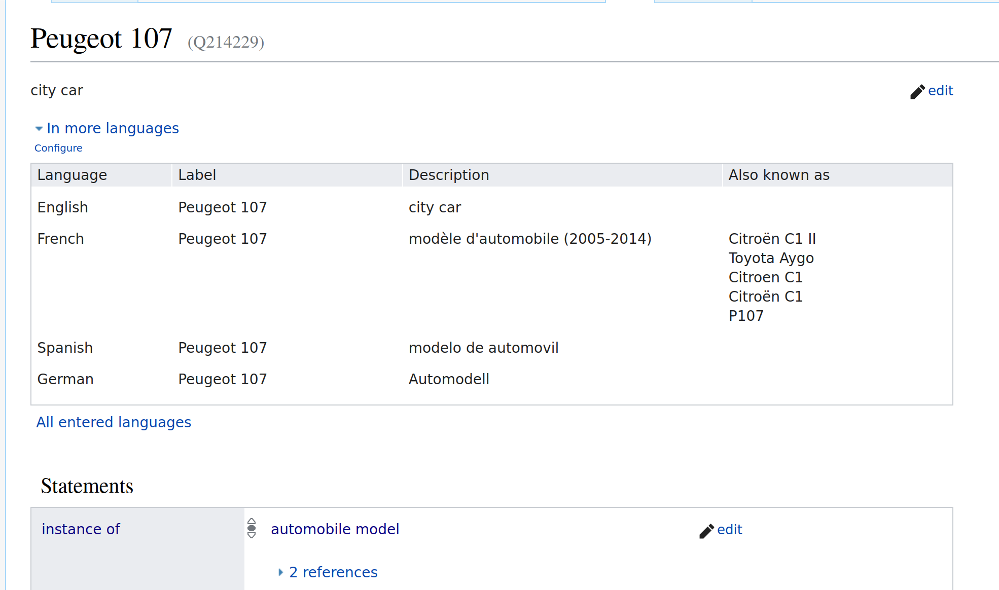

# Project: Query Answering over Linked Data
## Introduction

This report will be documenting my work over using linked data database to answer real world questions. The technology used for that will be SPARQL, a querying language close to SQL but specialized in the use of linked data databases. The work has been done in 2 Jupyter notebooks, one for each question of the project.

## Question 1

The first problem I tried to tackle in this project was to try to answer a rather simple but yet specialized question. It was for me a way to initiate myself to the use of the SPARQL language and the browsing of linked databases.

The question I choosed to answer was `"Which car is called a “duck” in German?"`.

To solve this problem I had to answer multiple interrogations I had, see below.

### What source of data should I use ?

The first thing to determine was which source of data should I use to answer the question ? Multiple valid choices existed, so I began experimenting.

#### DBPedia

The first source of data I knew of was the website of DBPedia https://www.dbpedia.org/. Because it was referenced during our semantic web course in Polytech, in first I began searching on their website how to manually browse their database, to see if I was able to find the entities that where linked to my question: a `duck` and a `car`. This was harder than I thought because DBPedia doesn't provide a way to manually research entities through a search bar in the manner of the Google search engine.
The only way I found to browse existing data was through SPARQL queries. That appeared too hard for me, so I quickly decided to search for another data source for my problem.

#### WikiData

The second data source I knew was WikiData accessible at the url https://www.wikidata.org/. This data source have the avantage to offer a search bar wich allow everyone to just type in a word or some text and find some close results to what you are looking for.

For instance for the entity corresponding to a duck, we can type in the word `duck` and instantly find a link to the corresponding ressource (see figure below).


Then by clicking on it we have all informations about the entity displayed. Here we can see that an unique identifier is assiocated to the duck entity: `Q3736439`. Thus we will be able to use it for our problem solving (see below).


### How to translate my problem in a SPARQL query ?

Now that the datasource is chosen, I need to translate my question in a SPARQL query. To do that I will need to identify the features of the SPARQL language that will be useful for my problem.

My problem is to determine `"Which car is called a “duck” in German?"`.

#### String comparaison

To find which car is called `"duck"` there will be a operation of string comparaison involved at some point in my query so I searched what I could use to accomplish this comparaison. I searched on a search engine `"comparing strings in sparql"` and found the following function:

```sql
FILTER(ex:ldistance(?string1, ?string2) < 2)
```

This function returns `true` if the two string provided have a `Levenshtein distance` inferior to 2 in the previous example. But when I tried using it it wasn't recognized as a valid function so I searched for another function.

```sql
FILTER(STRSTARTS(?string1, ?string2))
```

The second function I found to compare string was `STRSTARTS`. It returns `true` when `string1` starts with `string2`. It will be useful to compare the name of a duck in german with the name of the cars.

#### Entities involved

The two entities I wanted to use as a base for my query were the `duck` entity and the `car` entity. As shown previously I already found the `duck` entity easily. Then I had to find the `car` entity.

After doing a quick search in the search bar I found the entity `Q1420` (see figure below).


But when I wanted to list all car names I got only a few hundred names which is far from from the total number of names (see figure below) of car model, so I decided to use another entity.


I tried typing my car model name on WikiData search bar `Peugeot 107`. I found that the entity assiocated was instead `automobile model (Q3231690)`. So I decided to use this entity instead for my query (see below).



Finally I tried to use the `rdfs:label` of the entities to compare them (the duck and the car model). But after multiple unsuccessful results, I found out that the car model `rdfs:label` did not include the car's nickname. So I discovered I could use instead the `skos:altLabel` property of the entities that contained many more nicknames for the entity.

#### Filtering

As a final requirement I needed to filter my result, I wanted to compare only the german `skos:altLabel` of the car with the german `rdfs:label`. So I searched and found the `LANG` function (see below).

```sql
-- Car
?model wdt:P31 wd:Q3231690;
    skos:altLabel ?modelAlias;
    FILTER(LANG(?modelAlias) = "de").

-- Duck
wd:Q3736439 rdfs:label ?duckLabel;
    FILTER(LANG(?duckLabel) = "de").
```
#### The query and result

With all the previous work done earlier I finally was able to write a working query that gave me the following result (see below).

```sql
-- Which car is called a “duck” in German ?

CONSTRUCT {
    --      instance of    automobile model
    ?model wdt:P31         wd:Q3231690;
        skos:altLabel ?modelAlias;
        rdfs:label ?modelLabel.
            
    -- Duck
    wd:Q3736439 rdfs:label ?duckLabel.
}
WHERE 
{
    --     instance of     automobile model
    ?model wdt:P31         wd:Q3231690;
        skos:altLabel ?modelAlias;
        rdfs:label ?modelLabel;
    FILTER(LANG(?modelAlias) = "de").
    FILTER(LANG(?modelLabel) = "fr").
    FILTER(STRSTARTS(?duckLabel, ?modelAlias)).
            
    -- Duck
    wd:Q3736439 rdfs:label ?duckLabel;
        FILTER(LANG(?duckLabel) = "de").
    
}
```


Here we can see that the car found is the `Citroën 2CV`. They both have a label and/or an alias wich begin with the string `Ente`.

## Question 2

### Problem I want to solve
With what other famous people did Barck Obama studied throughout his life ?

### Data source

For this question I will use the same data source as the previous question: WikiData.

### Entities I need

For this question I will need the following entities:

- Barack Obama `Q76`
- Human `Q5`

### Relations I need

For this question I will need the following relations:

- educated at `P69`

### My experiments

#### Listing the schools of Barack Obama

To list the schools of Barack Obama I used the following query:

```sql
%%rdf sparql --endpoint https://query.wikidata.org/sparql

# With what other famous people did Barck Obama studied throughout his life ?

SELECT ?schoolLabel
WHERE 
{
    # Barrack Obama   # Educated At
    wd:Q76            wdt:P69          ?school.
    ?school rdfs:label ?schoolLabel;
        FILTER(LANG(?schoolLabel) = "en"). 
}
```

### Listing 100 people who have studied at the same school as Barack Obama

To list 100 people who have studied at the same school as Barack Obama I used the following query:

```sql
%%rdf sparql --endpoint https://query.wikidata.org/sparql

-- With what other famous people did Barck Obama studied throughout his life ?

SELECT ?personName
WHERE 
{
    -- Barrack Obama   -- Educated At
    wd:Q76            wdt:P69          ?school.
    ?school rdfs:label ?schoolLabel;
    FILTER(LANG(?schoolLabel) = "en").
    
            -- instance of  -- Human  
    ?person wdt:P31        wd:Q5;
        -- Educated At
        wdt:P69         ?school2;
        rdfs:label ?personName.
    FILTER(LANG(?personName) = "en").
    FILTER(?school = ?school2).
}
LIMIT 100
```

 ### Problem encountered


#### Filtering with date

 When I tried to filter the result to only keep the people who studied has Barack Obama did, It became harder for me. The relation `educated at` had a qualifier `start time` but I didn't know how to use it. So I had to look up WikiData documentation to find out how to use it.

 After reading the documentation I found an example describing a similar problem to mine. So I tried to use it in my query and after mutiple tries I finally got a working query.

```sql
    --! Educated At
    ?person p:P69 [
            --! Educated At
            ps:P69 ?school;
            --! Start Time
            pq:P580 ?date
        ];
```

Then I had to filter the result to only keep the people who studied at the same school as Barack Obama and who were in the same school as Barack Obama when he was also studying there.

```sql
FILTER(?school=?schoolObama && ((?startDate <= ?endDateObama &&  ?endDate >= ?startDateObama) || (?startDateObama <= ?endDate &&  ?endDateObama >= ?startDate)))
```
 #### Removing Barack Obama from the results

I also wanted to remove Barack Obama from the result, because Barack Obama indeed studied in the same school and at the same period that Barack Obama. So I had to find a way to remove him from the result. I tried to use the `FILTER`.

```sql
FILTER(?person != wd:Q76).
```

 ### The query and result


```sql
# With what other famous people did Barck Obama studied throughout his life ?


SELECT ?nom ?schoolName ?startDate ?endDate
WHERE {
      wd:Q76 wdt:P69 ?school.
      wd:Q76 p:P69 [
        ps:P69 ?schoolObama;
        pq:P580 ?startDateObama;
        pq:P582 ?endDateObama
      ].
  
      #educated at
      ?person p:P69 [
        ps:P69 ?school;
        # start time
        pq:P580 ?startDate;
        # end time
        pq:P582 ?endDate
      ].
    FILTER(?school=?schoolObama && ((?startDate <= ?endDateObama &&  ?endDate >= ?startDateObama) || (?startDateObama <= ?endDate &&  ?endDateObama >= ?startDate)))
  
    ?person rdfs:label ?nom.
    FILTER(LANG(?nom) = "en").
  
    ?school rdfs:label ?schoolName.
    FILTER(LANG(?schoolName) = "en").
  
    FILTER(?person != wd:Q76).
} 
```

Here we can see that Barack Obama was in the same school as the following people. For instance we find Michelle Obama in the same school as Barack Obama in Harvard Law School.

nom	schoolName	startDate	endDate
Elva Diaz	Harvard University	1989-09-01T00:00:00Z	1993-06-01T00:00:00Z
Alexander Wei	Harvard University	1989-01-01T00:00:00Z	1995-01-01T00:00:00Z
Rachel L Rosen	Harvard University	1990-01-01T00:00:00Z	1994-01-01T00:00:00Z
Conal Murray	Harvard University	1987-09-13T00:00:00Z	1992-06-06T00:00:00Z
Marios Mavronicolas	Harvard University	1984-01-01T00:00:00Z	1992-01-01T00:00:00Z
Christian Smith	Harvard University	1984-01-01T00:00:00Z	1990-01-01T00:00:00Z
Eric Weinstein	Harvard University	1985-01-01T00:00:00Z	1992-01-01T00:00:00Z
Lynn E Dobrunz	Harvard University	1984-01-01T00:00:00Z	1988-01-01T00:00:00Z
Michael Luke	Harvard University	1987-09-01T00:00:00Z	1989-06-30T00:00:00Z
Michael Luke	Harvard University	1987-09-01T00:00:00Z	1991-06-30T00:00:00Z
Charles Marcus	Harvard University	1990-01-01T00:00:00Z	1992-01-01T00:00:00Z
Charles Marcus	Harvard University	1984-09-01T00:00:00Z	1990-06-01T00:00:00Z
Robert C. Lieberman	Harvard University	1988-01-01T00:00:00Z	1994-01-01T00:00:00Z
Robert C. Lieberman	Harvard University	1988-01-01T00:00:00Z	1994-01-01T00:00:00Z
Kyriakos Mitsotakis	Harvard University	1986-01-01T00:00:00Z	1990-01-01T00:00:00Z
Andrew T Morehead	Harvard University	1985-09-21T00:00:00Z	1989-06-10T00:00:00Z
Mariana Chilton	Harvard University	1986-09-11T00:00:00Z	1991-06-01T00:00:00Z
Yong Hwan Kim	Harvard University	1987-09-01T00:00:00Z	1993-06-08T00:00:00Z
Scott Presnell	Harvard University	1983-09-01T00:00:00Z	1988-06-01T00:00:00Z
Erick Moran Carreira	Harvard University	1984-09-01T00:00:00Z	1990-05-31T00:00:00Z
Angela Duckworth	Harvard University	1988-01-01T00:00:00Z	1992-01-01T00:00:00Z
Kathleen Gallo	Harvard University	1985-01-01T00:00:00Z	1992-01-01T00:00:00Z
Yuh-Dauh Lyuu	Harvard University	1984-08-01T00:00:00Z	1989-11-01T00:00:00Z
Yuh-Dauh Lyuu	Harvard University	1984-08-01T00:00:00Z	1990-11-01T00:00:00Z
J. William Carey	Harvard University	1985-09-01T00:00:00Z	1991-06-01T00:00:00Z
Stephen C. Bunnell	Harvard University	1990-01-01T00:00:00Z	1998-01-01T00:00:00Z
Saumya Das	Harvard University	1987-09-01T00:00:00Z	1991-06-01T00:00:00Z
T Kwaku Dayie	Harvard University	1990-09-01T00:00:00Z	1996-05-01T00:00:00Z
Mark L Dell'Acqua	Harvard University	1989-09-01T00:00:00Z	1995-07-30T00:00:00Z
Sanford Sillman	Harvard University	1983-09-01T00:00:00Z	1988-01-20T00:00:00Z
Geoffrey S. Plumlee	Harvard University	1980-08-31T00:00:00Z	1989-06-06T00:00:00Z
Shelia M Kennison	Harvard University	1985-09-10T00:00:00Z	1989-06-10T00:00:00Z
Michael Pravica	Harvard University	1988-06-01T00:00:00Z	1998-06-01T00:00:00Z
Giuseppe Labianca	Harvard University	1985-09-01T00:00:00Z	1989-06-01T00:00:00Z
Qizhou Zhang	Harvard University	1991-01-01T00:00:00Z	1996-01-01T00:00:00Z
Darin Toohey	Harvard University	1982-09-01T00:00:00Z	1988-07-01T00:00:00Z
Chu, Ping-Tzu	Harvard University	1990-01-01T00:00:00Z	1998-01-01T00:00:00Z
Michael F. Koehler	Harvard University	1988-01-01T00:00:00Z	1992-01-01T00:00:00Z
Chaitanya Jain	Harvard University	1983-01-01T00:00:00Z	1991-01-01T00:00:00Z
Sheng Luan	Harvard University	1986-08-23T00:00:00Z	1991-08-31T00:00:00Z
Philip Seo	Harvard University	1989-09-01T00:00:00Z	1993-06-30T00:00:00Z
Jean T Greenberg	Harvard University	1983-01-01T00:00:00Z	1989-01-01T00:00:00Z
Randall S. Johnson	Harvard University	1986-09-01T00:00:00Z	1992-12-31T00:00:00Z
Jay W. Hooper	Harvard University	1989-01-01T00:00:00Z	1995-01-01T00:00:00Z
Bennett G. Novitch	Harvard University	1991-01-01T00:00:00Z	1998-01-01T00:00:00Z
Hongtao Yu	Harvard University	1990-09-01T00:00:00Z	1995-05-01T00:00:00Z
Jeffrey S Mckinnon	Harvard University	1987-09-01T00:00:00Z	1994-01-01T00:00:00Z
Bomie Han	Harvard University	1989-09-01T00:00:00Z	1995-06-01T00:00:00Z
Colin Philip Jessop	Harvard University	1987-06-01T00:00:00Z	1993-12-13T00:00:00Z
David Nathan Brown	Harvard University	1983-09-01T00:00:00Z	1989-06-01T00:00:00Z
Ann Stokes	Harvard University	1988-01-01T00:00:00Z	1993-01-01T00:00:00Z
Ivan Oransky	Harvard University	1990-09-01T00:00:00Z	1994-05-01T00:00:00Z
Sohee Park	Harvard University	1985-09-01T00:00:00Z	1991-06-07T00:00:00Z
Iain M. Cockburn	Harvard University	1984-01-01T00:00:00Z	1990-01-01T00:00:00Z
Joshua T. Cohen	Harvard University	1989-09-01T00:00:00Z	1994-06-01T00:00:00Z
James K. Chen	Harvard University	1987-09-01T00:00:00Z	1991-06-01T00:00:00Z
Ken Uchino	Harvard University	1986-09-01T00:00:00Z	1990-06-01T00:00:00Z
David J Yaron	Harvard University	1983-09-01T00:00:00Z	1990-06-01T00:00:00Z
David Wittman	Harvard University	1986-09-01T00:00:00Z	1990-06-01T00:00:00Z
María Paz Espinosa	Harvard University	1984-01-01T00:00:00Z	1988-01-01T00:00:00Z
David S Moore	Harvard University	1985-05-16T00:00:00Z	1988-05-15T00:00:00Z
Peter Groeneveld	Harvard University	1987-09-15T00:00:00Z	1991-06-06T00:00:00Z
Regina Llamas	Harvard University	1989-01-01T00:00:00Z	1992-01-01T00:00:00Z
James Livesey	Harvard University	1988-09-01T00:00:00Z	1994-11-30T00:00:00Z
Thomas R. Belin	Harvard University	1986-09-23T00:00:00Z	1991-06-12T00:00:00Z
Colin A Chapman	Harvard University	1990-01-01T00:00:00Z	1993-01-01T00:00:00Z
Kim Gutschow	Harvard University	1990-01-01T00:00:00Z	1998-01-01T00:00:00Z
Kim Gutschow	Harvard University	1984-01-01T00:00:00Z	1998-01-01T00:00:00Z
Hajime Tokuno	Harvard University	1984-08-01T00:00:00Z	1988-05-30T00:00:00Z
Christopher Cannon	Harvard University	1988-09-01T00:00:00Z	1993-06-15T00:00:00Z
Hyeonsik Cheong	Harvard University	1986-09-01T00:00:00Z	1993-06-08T00:00:00Z
Jin Chen	Harvard University	1986-06-21T00:00:00Z	1991-12-31T00:00:00Z
Huajian Gao	Harvard University	1983-09-01T00:00:00Z	1988-06-09T00:00:00Z
Phillip D. Zamore	Harvard University	1987-01-01T00:00:00Z	1992-06-01T00:00:00Z
David Morse	Harvard University	1985-01-01T00:00:00Z	1989-01-01T00:00:00Z
Yang Wang	Harvard University	1983-10-01T00:00:00Z	1990-06-01T00:00:00Z
Edus H Warren	Harvard University	1983-09-01T00:00:00Z	1988-11-01T00:00:00Z
Roland Dunbrack	Harvard University	1987-09-10T00:00:00Z	1993-06-10T00:00:00Z
Maureen A Su	Harvard University	1991-01-01T00:00:00Z	1995-01-01T00:00:00Z
Thomas T Perkins	Harvard University	1985-09-01T00:00:00Z	1989-06-01T00:00:00Z
Isabel Hanekamp	Harvard University	1987-09-01T00:00:00Z	1993-05-15T00:00:00Z
Jing-Shiang Hwang	Harvard University	1988-01-01T00:00:00Z	1992-01-01T00:00:00Z
Abigail S. Gertner	Harvard University	1986-01-01T00:00:00Z	1990-01-01T00:00:00Z
Ing-Shouh Hwang	Harvard University	1988-06-01T00:00:00Z	1993-06-01T00:00:00Z
Yves Balkanski	Harvard University	1985-09-01T00:00:00Z	1991-06-01T00:00:00Z
Karen M Ottemann	Harvard University	1988-09-20T00:00:00Z	1994-06-10T00:00:00Z
Kristin Wobbe	Harvard University	1984-01-01T00:00:00Z	1991-01-01T00:00:00Z
Pin Ouyang	Harvard University	1985-09-01T00:00:00Z	1992-08-01T00:00:00Z
Richard D. Norris	Harvard University	1986-08-15T00:00:00Z	1990-06-20T00:00:00Z
Leticia Avilés	Harvard University	1988-09-01T00:00:00Z	1992-05-15T00:00:00Z
Roland K Strong	Harvard University	1984-01-01T00:00:00Z	1990-01-01T00:00:00Z
Douglas K Bishop	Harvard University	1981-09-01T00:00:00Z	1988-05-01T00:00:00Z
Jih-I Yeh	Harvard University	1988-09-01T00:00:00Z	1995-06-01T00:00:00Z
Alison J. Frontier	Harvard University	1988-01-01T00:00:00Z	1992-06-01T00:00:00Z
Amir D Karger	Harvard University	1990-09-01T00:00:00Z	1994-06-10T00:00:00Z
Alisa Schoenbach	Harvard University	1989-09-01T00:00:00Z	1993-06-01T00:00:00Z
Jim Bryan	Harvard University	1989-06-01T00:00:00Z	1994-06-01T00:00:00Z
Kenneth H Yu	Harvard University	1991-01-01T00:00:00Z	1995-01-01T00:00:00Z
Robert Tykot	Harvard University	1984-01-01T00:00:00Z	1995-01-01T00:00:00Z
Grazyna Jasienska	Harvard University	1989-01-01T00:00:00Z	1996-01-01T00:00:00Z
Anne E West	Harvard University	1989-01-01T00:00:00Z	1998-01-01T00:00:00Z
Cheleste M Thorpe	Harvard University	1986-09-01T00:00:00Z	1989-06-01T00:00:00Z
Lincoln Greenhill	Harvard University	1984-09-01T00:00:00Z	1990-06-01T00:00:00Z
Kuei-Hsien Chen	Harvard University	1985-09-01T00:00:00Z	1989-06-30T00:00:00Z
Jeanne L Shea	Harvard University	1990-01-01T00:00:00Z	1998-01-01T00:00:00Z
Gilbert Gimm	Harvard University	1987-09-01T00:00:00Z	1992-05-28T00:00:00Z
Barbara L Dunn	Harvard University	1981-09-15T00:00:00Z	1988-12-10T00:00:00Z
Seiichi P T Matsuda	Harvard University	1986-09-01T00:00:00Z	1994-01-01T00:00:00Z
Robert T Brennan	Harvard University	1983-09-01T00:00:00Z	1989-06-01T00:00:00Z
David Ackerly	Harvard University	1987-05-01T00:00:00Z	1993-05-01T00:00:00Z
Soojin Ryu	Harvard University	1990-01-01T00:00:00Z	1994-01-01T00:00:00Z
Michael Spall	Harvard University	1983-09-01T00:00:00Z	1988-05-01T00:00:00Z
James Topitzes	Harvard University	1984-01-01T00:00:00Z	1998-01-01T00:00:00Z
Michal Jasienski	Harvard University	1985-01-01T00:00:00Z	1992-01-01T00:00:00Z
Wang Ming-ke	Harvard University	1987-01-01T00:00:00Z	1992-01-01T00:00:00Z
W. Dean Hively	Harvard University	1987-01-01T00:00:00Z	1990-01-01T00:00:00Z
Edward Frenkel	Harvard University	1990-01-01T00:00:00Z	1991-01-01T00:00:00Z
Santiago Madriñán	Harvard University	1989-09-01T00:00:00Z	1996-12-31T00:00:00Z
Paul Nihoul	Harvard University	1988-01-01T00:00:00Z	1989-01-01T00:00:00Z
Deborah A Hogan	Harvard University	1989-01-01T00:00:00Z	1993-01-01T00:00:00Z
Helen M Hanson	Harvard University	1988-09-01T00:00:00Z	1990-06-01T00:00:00Z
Helen M Hanson	Harvard University	1990-09-01T00:00:00Z	1995-06-01T00:00:00Z
Jeffrey A. Yoder	Harvard University	1990-01-01T00:00:00Z	1997-01-01T00:00:00Z
Edward Kearns	Harvard University	1982-05-01T00:00:00Z	1990-05-01T00:00:00Z
Frank S. Lee	Harvard University	1985-01-01T00:00:00Z	1991-01-01T00:00:00Z
Yana van der Meulen Rodgers	Harvard University	1987-09-01T00:00:00Z	1993-05-15T00:00:00Z
Yana van der Meulen Rodgers	Harvard University	1987-09-01T00:00:00Z	1989-05-15T00:00:00Z
Paul D King	Harvard University	1984-09-01T00:00:00Z	1988-06-08T00:00:00Z
Albert Young	Harvard University	1982-09-01T00:00:00Z	1990-06-01T00:00:00Z
Yuh Min Chook	Harvard University	1988-09-01T00:00:00Z	1993-11-30T00:00:00Z
Brian E Schultz	Harvard University	1989-01-01T00:00:00Z	1994-01-01T00:00:00Z
Chen-Ming Fan	Harvard University	1986-09-01T00:00:00Z	1991-08-01T00:00:00Z
Susan Wojcicki	Harvard University	1986-01-01T00:00:00Z	1990-01-01T00:00:00Z
John R. Iversen	Harvard University	1986-09-01T00:00:00Z	1990-06-01T00:00:00Z
Carlos A Klink	Harvard University	1987-09-22T00:00:00Z	1992-04-15T00:00:00Z
Leonardo Trasande	Harvard University	1990-09-01T00:00:00Z	1994-06-01T00:00:00Z
Benjamin S. Twining	Harvard University	1989-09-01T00:00:00Z	1997-05-01T00:00:00Z
Orlando D Schärer	Harvard University	1991-01-01T00:00:00Z	1996-01-01T00:00:00Z
Michael L Dustin	Harvard University	1984-09-01T00:00:00Z	1990-06-01T00:00:00Z
Allen H Goldstein	Harvard University	1989-09-01T00:00:00Z	1994-06-01T00:00:00Z
Lynn B. Dustin	Harvard University	1984-09-01T00:00:00Z	1990-06-01T00:00:00Z
Eva Huala	Harvard University	1983-06-01T00:00:00Z	1990-06-01T00:00:00Z
Sunil Shaw	Harvard University	1988-08-01T00:00:00Z	2005-06-01T00:00:00Z
Laura M Kasman	Harvard University	1987-08-15T00:00:00Z	1992-02-14T00:00:00Z
Chi-Kuang Sun	Harvard University	1990-09-01T00:00:00Z	1994-11-01T00:00:00Z
Olav Sorenson	Harvard University	1988-01-01T00:00:00Z	1991-01-01T00:00:00Z
Janet Conrad	Harvard University	1986-01-01T00:00:00Z	1993-01-01T00:00:00Z
Peter Goekjian	Harvard University	1984-09-01T00:00:00Z	1990-12-14T00:00:00Z
Savdeep Sethi	Harvard University	1991-01-01T00:00:00Z	1992-01-01T00:00:00Z
Savdeep Sethi	Harvard University	1991-01-01T00:00:00Z	1996-01-01T00:00:00Z
Shing Chuan Hooi	Harvard University	1987-01-01T00:00:00Z	1992-01-01T00:00:00Z
David DeBoer	Harvard University	1985-01-01T00:00:00Z	1989-01-01T00:00:00Z
Chiou-Shann Fuh	Harvard University	1987-09-01T00:00:00Z	1992-06-04T00:00:00Z
Christos Delidakis	Harvard University	1981-05-01T00:00:00Z	1988-05-01T00:00:00Z
Kristin Mugford	Harvard University	1985-01-01T00:00:00Z	1989-01-01T00:00:00Z
Michael Manga	Harvard University	1990-09-01T00:00:00Z	1994-06-01T00:00:00Z
Bert Vaux	Harvard University	1990-09-01T00:00:00Z	1992-06-01T00:00:00Z
Bert Vaux	Harvard University	1990-09-01T00:00:00Z	1994-05-24T00:00:00Z
Diane Tang	Harvard University	1991-01-01T00:00:00Z	1995-01-01T00:00:00Z
Nigel Rothfels	Harvard University	1987-01-01T00:00:00Z	1994-01-01T00:00:00Z
Shadi Bartsch	Harvard University	1987-09-01T00:00:00Z	1988-06-01T00:00:00Z
Ketanji Brown Jackson	Harvard University	1988-01-01T00:00:00Z	1992-01-01T00:00:00Z
Ria Carlo	Harvard University	1989-01-01T00:00:00Z	1992-01-01T00:00:00Z
Andrew Perchuk	Columbia University	1980-01-01T00:00:00Z	1985-01-01T00:00:00Z
John-Stephen Taylor	Columbia University	1976-01-01T00:00:00Z	1981-01-01T00:00:00Z
David C Schwartz	Columbia University	1980-01-01T00:00:00Z	1985-01-01T00:00:00Z
Rongjia Tao	Columbia University	1979-09-01T00:00:00Z	1982-05-19T00:00:00Z
Uri S. ten Brink	Columbia University	1981-01-01T00:00:00Z	1986-09-01T00:00:00Z
Ellen S. Kappel	Columbia University	1980-09-01T00:00:00Z	1985-10-01T00:00:00Z
Joel Stein	Columbia University	1978-09-01T00:00:00Z	1982-06-01T00:00:00Z
Stanley Alama	Columbia University	1980-05-21T00:00:00Z	1984-05-21T00:00:00Z
Étienne Li	Columbia University	1980-01-01T00:00:00Z	1986-01-01T00:00:00Z
Stephen Rayport	Columbia University	1975-09-01T00:00:00Z	1981-05-15T00:00:00Z
Stephen Rayport	Columbia University	1975-09-01T00:00:00Z	1982-05-15T00:00:00Z
Germán Fuertes Otero	Harvard University	1990-01-01T00:00:00Z	1995-01-01T00:00:00Z
Luis Manuel Navas	Harvard University	1984-01-01T00:00:00Z	1988-01-01T00:00:00Z
Daniel S Budnitz	Harvard University	1989-01-01T00:00:00Z	1993-01-01T00:00:00Z
Mun Sing Ho	Harvard University	1983-01-01T00:00:00Z	1989-01-01T00:00:00Z
Michael Merrifield	Harvard University	1986-08-01T00:00:00Z	1990-08-01T00:00:00Z
Paolo Salvatore Andrea Palladino	Columbia University	1978-01-01T00:00:00Z	1982-01-01T00:00:00Z
Robert Cook	Columbia University	1974-01-01T00:00:00Z	1981-01-01T00:00:00Z
Brian McGill	Harvard University	1984-09-01T00:00:00Z	1988-06-01T00:00:00Z
Scott Atran	Columbia University	1973-09-01T00:00:00Z	1984-06-01T00:00:00Z
David F. Phillips	Harvard University	1988-09-01T00:00:00Z	1996-01-15T00:00:00Z
Robert J O'Hara	Harvard University	1984-01-01T00:00:00Z	1989-01-01T00:00:00Z
Li-Chyong Chen	Harvard University	1983-09-01T00:00:00Z	1989-08-31T00:00:00Z
Robert F. Standaert	Harvard University	1988-09-01T00:00:00Z	1992-06-02T00:00:00Z
Christopher H. Schmid	Harvard University	1985-09-01T00:00:00Z	1991-09-01T00:00:00Z
Joshua M. Brickman	Harvard University	1988-09-21T00:00:00Z	1996-06-01T00:00:00Z
Arianna Carughi	Columbia University	1981-01-01T00:00:00Z	1982-01-01T00:00:00Z
Philip Barnett	Columbia University	1979-08-01T00:00:00Z	1981-06-30T00:00:00Z
John Shea	Harvard University	1984-09-01T00:00:00Z	1992-06-01T00:00:00Z
Andrew Metrick	Harvard University	1989-01-01T00:00:00Z	1994-01-01T00:00:00Z
Detlev Wolter	Columbia University	1983-01-01T00:00:00Z	1985-01-01T00:00:00Z
Randall T Espinoza	Columbia University	1982-01-01T00:00:00Z	1986-01-01T00:00:00Z
Stephen W Wright	Harvard University	1982-01-01T00:00:00Z	1988-01-01T00:00:00Z
Lorence Kim	Harvard University	1991-01-01T00:00:00Z	1995-01-01T00:00:00Z
Kimberley Harris	Harvard University	1988-01-01T00:00:00Z	1992-01-01T00:00:00Z
Laura F Landweber	Harvard University	1989-09-01T00:00:00Z	1993-06-01T00:00:00Z
Daniel M Kammen	Harvard University	1985-01-01T00:00:00Z	1988-06-10T00:00:00Z
Meredith R. Golomb	Harvard University	1986-01-01T00:00:00Z	1990-01-01T00:00:00Z
Grace Chen	Harvard University	1989-01-01T00:00:00Z	1993-01-01T00:00:00Z
George Ho	Harvard University	1986-01-01T00:00:00Z	1990-01-01T00:00:00Z
J T Hunt	Columbia University	1979-01-01T00:00:00Z	1981-01-01T00:00:00Z
Susan E LaFlamme	Columbia University	1978-01-01T00:00:00Z	1985-01-01T00:00:00Z
Bradford M Clement	Columbia University	1979-01-01T00:00:00Z	1985-01-01T00:00:00Z
Alan Crosswell	Columbia University	1977-09-01T00:00:00Z	1981-05-01T00:00:00Z
Simon J D Cox	Columbia University	1981-09-16T00:00:00Z	1987-03-15T00:00:00Z
Moshe Olshansky	Columbia University	1980-09-15T00:00:00Z	1986-05-13T00:00:00Z
Betty Wolder Levin	Columbia University	1977-01-01T00:00:00Z	1986-10-01T00:00:00Z
Larry Catá Backer	Columbia University	1979-08-15T00:00:00Z	1982-05-15T00:00:00Z
Nancy L Sloan	Columbia University	1979-09-01T00:00:00Z	1985-08-01T00:00:00Z
Michelle A. Kominz	Columbia University	1978-09-01T00:00:00Z	1986-06-01T00:00:00Z
Asher Shor	Columbia University	1974-09-01T00:00:00Z	1981-01-01T00:00:00Z
Annelise Riles	Harvard University	1990-01-01T00:00:00Z	1993-01-01T00:00:00Z
Kentaro Toyama	Harvard University	1987-01-01T00:00:00Z	1991-01-01T00:00:00Z
Karen Nipps	Columbia University	1983-01-01T00:00:00Z	1984-01-01T00:00:00Z
Arthur M Mercurio	Columbia University	1975-09-07T00:00:00Z	1981-05-19T00:00:00Z
Sung-Yun Pai	Harvard University	1985-01-01T00:00:00Z	1989-01-01T00:00:00Z
Ajay Nagpal	Harvard University	1990-01-01T00:00:00Z	1992-01-01T00:00:00Z
Jeffrey Glueck	Harvard University	1987-01-01T00:00:00Z	1991-01-01T00:00:00Z
Nirav R Shah	Harvard University	1990-01-01T00:00:00Z	1994-01-01T00:00:00Z
Lisa Shalett	Harvard University	1984-01-01T00:00:00Z	1988-01-01T00:00:00Z
Shulamith Lala Ashenberg Straussner	Columbia University	1979-09-01T00:00:00Z	1986-05-01T00:00:00Z
Robert Sclafani	Columbia University	1977-06-02T00:00:00Z	1981-05-01T00:00:00Z
David Sassoon	Columbia University	1981-09-01T00:00:00Z	1986-02-01T00:00:00Z
Michael J Imperiale	Columbia University	1976-01-01T00:00:00Z	1981-01-01T00:00:00Z
Millard F. Coffin	Columbia University	1981-06-01T00:00:00Z	1985-05-31T00:00:00Z
Alan C. Mix	Columbia University	1978-09-01T00:00:00Z	1985-12-01T00:00:00Z
Leonardo Bronfman	Columbia University	1980-09-01T00:00:00Z	1986-05-01T00:00:00Z
Peter J Michael	Columbia University	1975-09-01T00:00:00Z	1983-01-01T00:00:00Z
Pietro Reichlin	Columbia University	1982-09-01T00:00:00Z	1987-01-01T00:00:00Z
Scott Powers	Columbia University	1977-09-01T00:00:00Z	1983-02-01T00:00:00Z
Xi Zhan	Columbia University	1983-01-01T00:00:00Z	1988-01-01T00:00:00Z
Ken Ofori-Atta	Columbia University	1980-08-01T00:00:00Z	1984-01-01T00:00:00Z
Dr Mian Wu	Columbia University	1982-02-01T00:00:00Z	1988-10-26T00:00:00Z
Kimyeong Lee	Columbia University	1982-09-01T00:00:00Z	1987-01-01T00:00:00Z
Edward A. Whittaker	Columbia University	1976-09-01T00:00:00Z	1982-05-20T00:00:00Z
Edward Keating	Columbia University	1981-01-01T00:00:00Z	1983-01-01T00:00:00Z
Carol Raymond	Columbia University	1982-09-01T00:00:00Z	1989-06-01T00:00:00Z
Paul B. Reid	Columbia University	1975-09-01T00:00:00Z	1981-08-01T00:00:00Z
Saeqa Vrtilek	Columbia University	1982-02-01T00:00:00Z	1985-10-30T00:00:00Z
Michelle Obama	Harvard Law School	1985-01-01T00:00:00Z	1988-01-01T00:00:00Z
Adam P. Dicker	Columbia University	1980-09-01T00:00:00Z	1984-05-01T00:00:00Z
Joshua Bloch	Columbia University	1978-01-01T00:00:00Z	1982-01-01T00:00:00Z
Edward P. Hartouni	Columbia University	1976-07-01T00:00:00Z	1984-07-01T00:00:00Z
Serap Aksoy	Columbia University	1978-01-01T00:00:00Z	1982-01-01T00:00:00Z
Alexander Acosta	Harvard Law School	1990-01-01T00:00:00Z	1994-01-01T00:00:00Z
Zev M Trachtenberg	Columbia University	1980-09-01T00:00:00Z	1988-05-01T00:00:00Z
Ian Harrow	Columbia University	1981-01-01T00:00:00Z	1984-01-01T00:00:00Z
Ian Wooton	Columbia University	1979-01-01T00:00:00Z	1982-01-01T00:00:00Z
Henry Kerner	Harvard Law School	1989-09-01T00:00:00Z	1992-05-01T00:00:00Z
Cecile Paris	Columbia University	1980-09-01T00:00:00Z	1987-09-01T00:00:00Z
Emmanuel Levacher	Columbia University	1981-01-01T00:00:00Z	1982-01-01T00:00:00Z
Eric Laursen	Columbia University	1978-01-01T00:00:00Z	1982-01-01T00:00:00Z
Michael Travisano	Columbia University	1979-05-01T00:00:00Z	1983-05-01T00:00:00Z
Thomas M. Dame	Columbia University	1976-01-01T00:00:00Z	1982-05-01T00:00:00Z
Mehmet S Çelik	Columbia University	1977-09-01T00:00:00Z	1982-05-31T00:00:00Z
Linda A. Dimeff	Occidental College	1980-01-01T00:00:00Z	1984-01-01T00:00:00Z
Les Gara	Harvard Law School	1985-01-01T00:00:00Z	1988-01-01T00:00:00Z
Avraham Tabbach	University of Chicago Law School	1999-01-01T00:00:00Z	2003-01-01T00:00:00Z
H. Scott Bjerke	Punahou School	1969-01-01T00:00:00Z	1975-01-01T00:00:00Z
Richard S Kornbluth	Columbia University	1978-07-01T00:00:00Z	1983-09-01T00:00:00Z
Donald P Gaver	Occidental College	1977-01-01T00:00:00Z	1982-01-01T00:00:00Z
Larry O. Natt Gantt, II	Harvard Law School	1991-01-01T00:00:00Z	1994-01-01T00:00:00Z
Chris Varelas	Occidental College	1981-01-01T00:00:00Z	1985-01-01T00:00:00Z