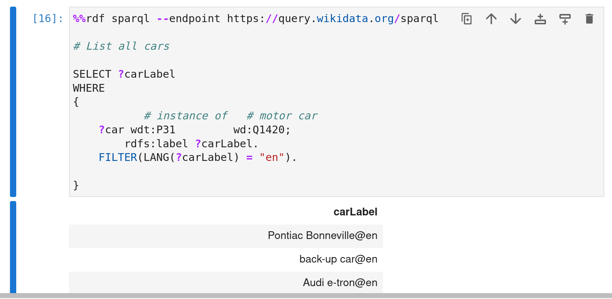

# Project: Query Answering over Linked Data


Using linked data database to answer real world questions.

Polytech Paris Saclay
Germain Rullier - APP5 Info

---

## Question 1

`"Which car is called a “duck” in German?"`.

To solve this problem I had to answer multiple interrogations I had, see below.

---

### What source of data should I use ?


#### DBPedia

 - https://www.dbpedia.org/.
 - Referenced during our semantic web course
 - DBPedia doesn't provide a way to manually research entities through a search bar
- Only way I found to browse existing data was through SPARQL queries.
- That appeared too hard for me
---

### What source of data should I use ?

#### WikiData

- https://www.wikidata.org/. 
- Offers a search bar
- We can type in the word `duck`

- Unique identifier is assiocated to the duck entity: `Q3736439`.


---


---

### How to translate my problem in a SPARQL query ?

- Identify the features of the SPARQL language that will be useful for my problem.

- `"Which car is called a “duck” in German?"`.

---
#### String comparaison

- Searched on a search engine `"comparing strings in sparql"` and found the following function:

```sql
FILTER(ex:ldistance(?string1, ?string2) < 2)
```

- Returns `true` if the two string provided have a `Levenshtein distance` inferior to 2. 
  
---
#### String comparaison (2)


- But not a valid function so I searched for another function.

```sql
FILTER(STRSTARTS(?string1, ?string2))
```

- The second function I found to compare string was `STRSTARTS`.
  
- It will be useful to compare the name of a duck in german with the name of the cars.

---
#### Entities involved

- Entities were the `duck` entity and the `car` entity.
- I had to find the `car` entity and found the entity `Q1420` (see figure below).


---
#### Entities involved (2)

- Only a few hundred names 



---
#### Entities involved (3)

- I decided to use another entity.

- I tried typing my car model `Peugeot 107`.
-  `automobile model (Q3231690)`. 


---
#### Entities involved (4)


- I tried to use the `rdfs:label` of the entities to compare them
- Multiple unsuccessful results
- I found out that the car model `rdfs:label` did not include the car's **nickname**. 
-  I could use instead the `skos:altLabel` property of the entities that contained many more nicknames for the entity.

---

#### Filtering

- I wanted to compare only the german `skos:altLabel` of the car with the german `rdfs:label`. So I searched and found the `LANG` function (see below).

```sql
-- Car
?model wdt:P31 wd:Q3231690;
    skos:altLabel ?modelAlias;
    FILTER(LANG(?modelAlias) = "de").

-- Duck
wd:Q3736439 rdfs:label ?duckLabel;
    FILTER(LANG(?duckLabel) = "de").
```

---

#### The query and result

```sql
CONSTRUCT {-- Hidden }
WHERE 
{
    --     instance of     automobile model
    ?model wdt:P31         wd:Q3231690;
        skos:altLabel ?modelAlias;
        rdfs:label ?modelLabel;
    FILTER(LANG(?modelAlias) = "de").
    FILTER(LANG(?modelLabel) = "fr").
    FILTER(STRSTARTS(?duckLabel, ?modelAlias)).
            
    -- Duck
    wd:Q3736439 rdfs:label ?duckLabel;
        FILTER(LANG(?duckLabel) = "de").
}
```
---
#### The query and result (2)


- Here we can see that the car found is the `Citroën 2CV`. 
- They both have a label and/or an alias wich begin with the string `Ente`.

---

## Question 2

### Problem I want to solve

`With what other famous people did Barck Obama studied throughout his life ?`


---
### Data source

- For this question I will use the same data source as the previous question

- WikiData.

---

### Entities I need

- Barack Obama `Q76`
- Human `Q5`

---

### Relations I need

- educated at `P69`

---

### Listing the schools of Barack Obama

To list the schools of Barack Obama I used the following query:

```sql
%%rdf sparql --endpoint https://query.wikidata.org/sparql

-- With what other famous people did Barck Obama studied 
-- throughout his life ?

SELECT ?schoolLabel
WHERE 
{
    # Barrack Obama   # Educated At
    wd:Q76            wdt:P69          ?school.
    ?school rdfs:label ?schoolLabel;
        FILTER(LANG(?schoolLabel) = "en"). 
}
```

---

#### Listing the schools of Barack Obama (results)


---

##### Listing 100 people who have studied at the same school as Barack Obama


```sql
SELECT ?personName
WHERE 
{
    -- Barrack Obama   -- Educated At
    wd:Q76            wdt:P69          ?school.
    ?school rdfs:label ?schoolLabel;
    FILTER(LANG(?schoolLabel) = "en").
            -- instance of  -- Human  
    ?person wdt:P31        wd:Q5;
        -- Educated At
        wdt:P69         ?school2;
        rdfs:label ?personName.
    FILTER(LANG(?personName) = "en").
    FILTER(?school = ?school2).
}
LIMIT 100
```
---

#### Problem encountered: Filtering with date

- The relation `educated at` had a qualifier `start time` 
- I didn't know how to use it. 
- So I had to look up WikiData documentation to find out how to use it.

```sql
    --! Educated At
    ?person p:P69 [
            --! Educated At
            ps:P69 ?school;
            --! Start Time
            pq:P580 ?date
        ];
```
---
#### Problem encountered: Filtering with date

```sql
FILTER(?school=?schoolObama 
&& ((?startDate <= ?endDateObama 
&&  ?endDate >= ?startDateObama) 
|| (?startDateObama <= ?endDate 
&&  ?endDateObama >= ?startDate)))
```
---

 #### Problem encountered: Removing Barack Obama from the results

- **Barack Obama** and **Barack Obama** studied in the same school!!!  

- I wanted to remove Barack Obama from the results

- So I had to find a way to remove him from the result. I tried to use the `FILTER`.

```sql
FILTER(?person != wd:Q76).
```

---

#### The query and result

```sql
SELECT ?nom ?schoolName ?startDate ?endDate
WHERE {
      wd:Q76 wdt:P69 ?school.
      wd:Q76 p:P69 [
        ps:P69 ?schoolObama;pq:P580 ?startDateObama;
        pq:P582 ?endDateObama].
      -- educated at
      ?person p:P69 [
        ps:P69 ?school;
        pq:P580 ?startDate;
        pq:P582 ?endDate
      ].
    FILTER(?school=?schoolObama && ((?startDate <= ?endDateObama &&  ?endDate >= ?startDateObama) || (?startDateObama <= ?endDate &&  ?endDateObama >= ?startDate)))
    ?person rdfs:label ?nom.
    FILTER(LANG(?nom) = "en").?school rdfs:label ?schoolName.
    FILTER(LANG(?schoolName) = "en").
    FILTER(?person != wd:Q76).
} 
```

---
#### The query and result (2)

- **Michelle Obama** studied in the same school as Barack Obama in **Harvard Law School**.


---
# Thank you


